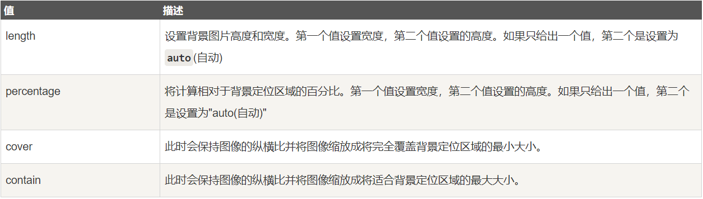
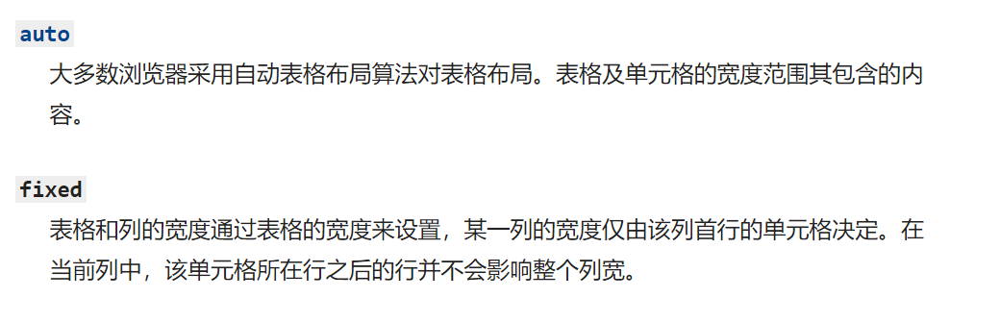
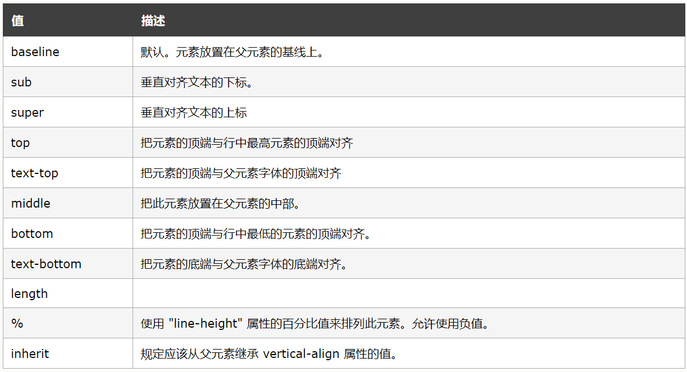

1. line-height
值可以是数字，百分比，像素值，em，normal（默认值）

除具体像素值之外，其他均要计算，即行高*font-size

继承后，若父元素的值为数字，那子元素的line-height就是子元素的font-size乘数字，若是其他数值，就是父元素的font-size乘百分比或em，子元素直接继承父元素那样所计算出的行高

2. -webkit-font-smoothing

抗锯齿性，使用后让字体看起来更舒服

有三个属性值：
- none：对低像素文本较好
- subpixel-antialiased ：默认值
- antialiased：抗锯齿很好

3. base标签

设置基础的url，也可以设置基础的target，一个页面值可以有一个base标签
为页面上的所有链接规定默认地址或默认目标。

4. h1~h6

区别是权重，在用户搜索的时候的权重

h1用于页面的总标题
h2用于页面父标题
h3用于页面中板块的标题
h4用于板块里面的标题

5. 关于嵌套

行盒不能包含块盒(可以直接改行盒的display)

6. 盒模型
 (1) 标准盒模型
        总宽(高)度=border+padding+width(height)
 (2) IE盒模型(怪异盒模型)
        总宽(高)度=width(height)
触发IE盒模型的要使用box-sizing属性

7. form标签
通常，会将整个表单元素，放置到form元素的内部，作用是当提交表单时，会将form元素内部的表单内容以合适的方式提交到服务器

使用时必须有name属性

action属性表示把表单内容提交给具体哪个服务器，默认是本页面

method属性表示提交方式

对静态页面的开发用处不大

8. 以图换字

设置background属性，使用url放链接地址
然后用text-indent将它首行缩进到看不见的程度

9. 渐变

C3属性，兼容IE10以上
```css
background-image: linear-gradient(to right,#ff9000,#ff5000);
```
参数分别是方向，起始颜色和结束颜色
要兼容到IE8以下要使用filter（使用时建议搜索具体使用方法）
方向还可以是角度

10. calc()

计算函数兼容IE9+
计算符号前后必须要有空格

11. rgba()

支持情况是IE9+
rgba()里面的透明度变化是只有背景，不包括文字
opacity透明度变化指盒子整体，包括文字
要兼容到IE8以下同样要使用filter

12. background-size

本身盒子的长宽设置后，background-size设置的是背景图的size，会让背景图恰当的显示在盒子里面
还有他的具体属性值

背景图默认充斥内容盒

13. table

为什么表格不再适用于页面布局？因为表格的渲染速度过慢

border-collapse: collapse;

表示边框的折叠方式，collapse表示把表格的相邻边框合并，separate即默认值，表示不合并，该属性值要写在table里面

表尾合计时需要合并前面的表格，可在tfoot里的td元素加上colspan属性，多少个合并为一个单元格就填多少

例如

```html
<td colspan="5">合计：XXXX</td>

```
==table里面的很多属性值其实都不建议使用，因为很多都已经被废弃了==
图片*3
在表格里面跨行是在tr元素里面加上rowspan属性，并且去掉被跨行的该单元格的td
rowspan里面填写的数值是，当你要几行合并为一行的那个行数

table-layout: fixed;
表示td的宽度的计算方式，fixed为自适应tr的宽，均分tr 

14. inline-block

结合的行内和块级的优点，既可以设置长宽，可以让padding和margin生效，又可以和其他行内元素并排。
当给ul里面的li设置为inline-block时，li会按顺序水平排列

15. vertical-align

定义==行内元素==的基线相对于该元素所在行的基线的垂直对齐

也可以填入数值，正值向上移动，负值向下移动

